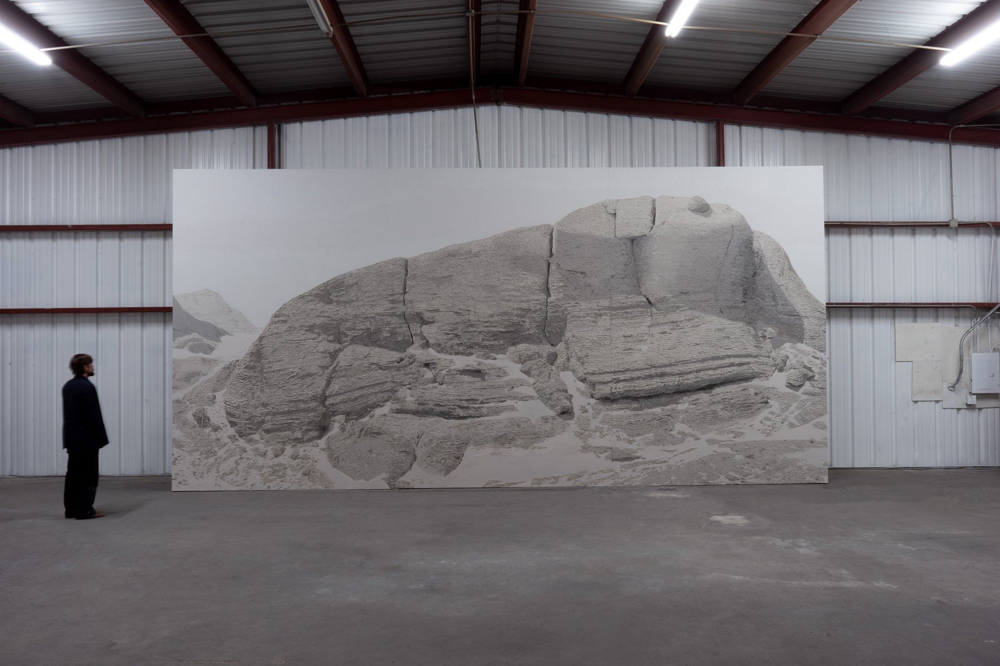

MSL Mastcam PDS4 Image Processor

A Python command-line tool for batch-processing raw Mars Science Laboratory (MSL) Curiosity rover Mastcam images from NASA's Planetary Data System (PDS4) archive into viewable colour PNGs.

Takes PDS4 XML labels and their associated raw `.IMG` files, applies Bayer demosaicing, white balance, colour correction, and contrast stretching to produce natural-colour images of the Martian surface.

## What It Does

Raw Mastcam EDR (Experiment Data Record) images are stored as single-channel Bayer-mosaic data with a binary header.
Information about the Mastcam can be found here: https://agupubs.onlinelibrary.wiley.com/doi/10.1002/2016EA000219

1. Parses PDS4 XML labels to extract image dimensions, byte offsets, and the referenced data file
2. Reads raw binary image data at the correct offset, handling subframes
3. Demosaics the Bayer pattern (GRBG per Mastcam KAI-2020 spec) into full RGB using VNG interpolation
4. Applies white balance using a gray-world algorithm
5. Corrects colour cast typical of raw Mastcam EDRs (reduces blue, boosts red)
6. Stretches contrast via percentile clipping (0.5%–99.5%)
7. Saves the result as a PNG

## Requirements

- Python 3.8+
- NumPy
- OpenCV (`opencv-python`)

```bash
pip install numpy opencv-python
```

## Installation

```bash
git clone https://github.com/<your-username>/curiosity-raw-image-pipeline.git
cd mastcam-pds-processor
pip install numpy opencv-python
```

## Usage

### Process a single file

```bash
python process_mastcam_pds.py 0042ML0002000000E1_DXXX.xml
```

### Process multiple files

```bash
python process_mastcam_pds.py label1.xml label2.xml label3.xml
```

### Process an entire directory (recursive)

Drop a folder of XML + IMG files and process them all:

```bash
python process_mastcam_pds.py ./raw_data/
```

### Process multiple directories

```bash
python process_mastcam_pds.py ./sol_042/ ./sol_043/ ./sol_044/
```

### Mix files and directories

```bash
python process_mastcam_pds.py ./sol_042/ extra_label.xml ./sol_043/
```

### Custom output directory

```bash
python process_mastcam_pds.py ./raw_data/ --output ./processed/
```

### Override Bayer pattern

```bash
python process_mastcam_pds.py ./raw_data/ --bayer gbrg
```

## CLI Reference

```
usage: process_mastcam_pds.py [-h] [-o OUTPUT] [-b {rggb,gbrg,grbg,bggr}]
                               inputs [inputs ...]

Batch-process MSL Mastcam PDS4 EDR images into colour PNGs.

positional arguments:
  inputs                One or more XML label files or directories containing them.

options:
  -h, --help            show this help message and exit
  -o, --output OUTPUT   Directory for output PNGs (default: same directory as source).
  -b, --bayer {rggb,gbrg,grbg,bggr}
                        Override the Bayer pattern (default: rggb from label metadata).
```


## Data Source

Raw Curiosity Mastcam EDR images can be downloaded from NASA's PDS Image Atlas:
https://pds-imaging.jpl.nasa.gov/tools/atlas/archive-explorer?mission=msl&bundle=annex_ehlmann_caltech_msl_msam2&pds=4&uri=atlas:pds4:msl:curiosity:/annex_ehlmann_caltech_msl_msam2/browse/sol

Each image consists of a pair of files:
- `.xml` — PDS4 label containing metadata (dimensions, byte offset, instrument info)
- `.IMG` — Raw binary image data (Bayer-mosaic, 8-bit unsigned)

## How It Works

### PDS4 Label Parsing

The XML label contains the `Array_2D_Image` element with:
- **`offset`** — Byte position where pixel data begins in the `.IMG` file
- **`Axis_Array`** elements — `Line` (height) and `Sample` (width) dimensions
- **`file_name`** — The referenced binary data file

### Bayer Demosaicing

Mastcam uses a Bayer colour filter array (CFA) on its Kodak KAI-2020 CCD. The unit cell is **GR/BG (GRBG)**, as documented in [Bell et al. 2017](https://agupubs.onlinelibrary.wiley.com/doi/full/10.1002/2016EA000219) and the [NASA Mastcam instrument page](https://mars.nasa.gov/msl/spacecraft/instruments/mastcam/for-scientists/):

> "Integrated over each detector is an RGB Bayer pattern filter (GR/BG unit cell)."

```
Row 0:  G R G R G R ...
Row 1:  B G B G B G ...
Row 2:  G R G R G R ...
```

OpenCV naming caveat: OpenCV names Bayer patterns from the *second* row and column of the CFA, not the top-left 2×2 like the rest of the world (MATLAB, camera vendors, NASA). This means OpenCV's `COLOR_BayerGB2BGR` is the correct constant for the real-world GRBG pattern. See [opencv/opencv#19629](https://github.com/opencv/opencv/issues/19629) for details. This tool handles the mapping internally — just pass standard pattern names (`grbg`, `rggb`, etc.) and the correct OpenCV constant is selected automatically.

### Colour Pipeline

| Stage | Method | Purpose |
|---|---|---|
| Demosaic | OpenCV Bayer→BGR (GRBG default) | Reconstruct full colour from CFA |
| White Balance | Gray-world (channel mean normalisation) | Remove colour temperature bias |
| Colour Correct | Per-channel gain (R×1.1, G×1.0, B×0.85) | Reduce blue cast in raw EDRs |
| Contrast Stretch | Percentile clip (0.5%–99.5%) | Map dynamic range to 0–255 |

## Project Structure

```
mastcam-pds-processor/
├── process_mastcam_pds.py   # Main processing script
├── README.md                # This file
└── raw_data/                # Your downloaded PDS4 data (not tracked)
    ├── 0042ML0002000000E1_DXXX.xml
    ├── 0042ML0002000000E1_DXXX.IMG
    └── ...
```

## Application

The processed imagery from this pipeline is used to generate 3D photogrammetry assets (via RealityScan) for building Martian simulation environments in Unreal Engine.

This project grew out of a broader Mars visualization practice that includes monumental-scale paintings of the Martian surface created from JPL-processed Mastcam imagery:




## Acknowledgements

- NASA/JPL-Caltech/MSSS for the MSL Mastcam instrument and public data archive
- Planetary Data System (PDS) for the PDS4 data standard
- Image processing informed by the [PDS4 Data Standards](https://pds.nasa.gov/datastandards/documents/)
